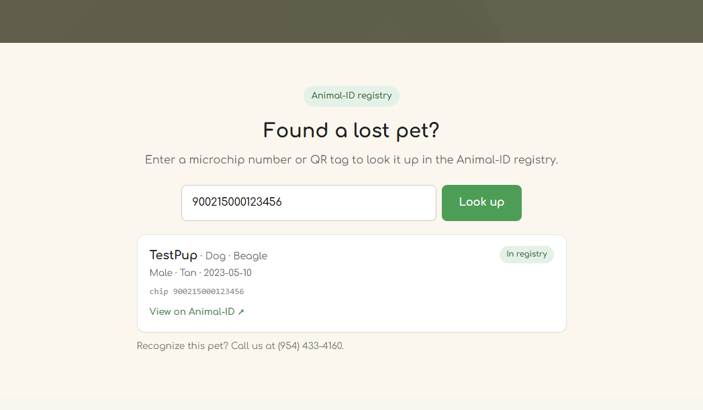
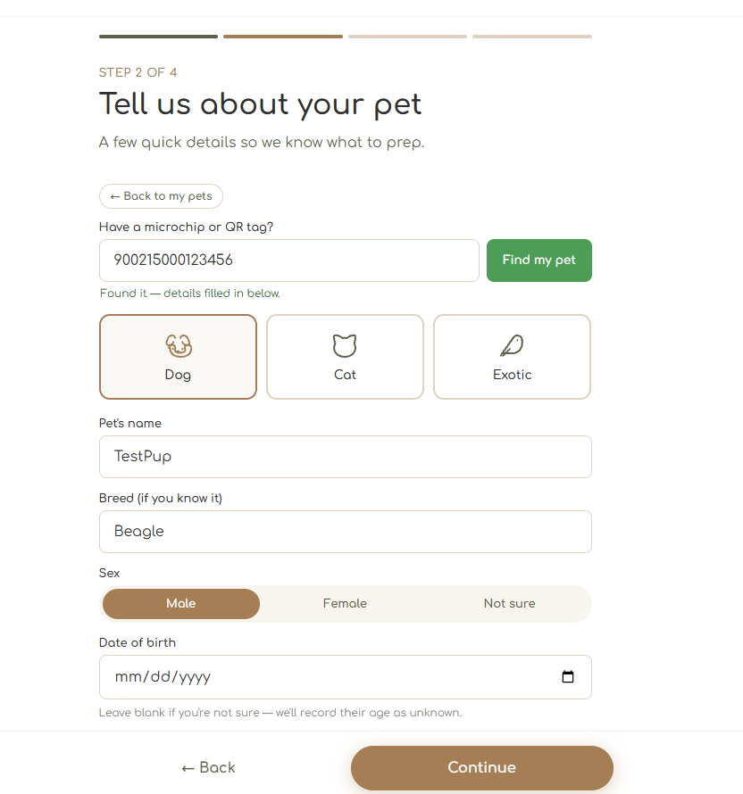
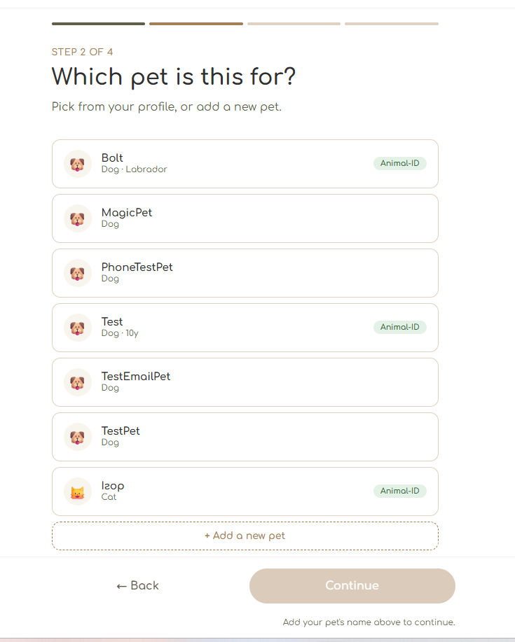
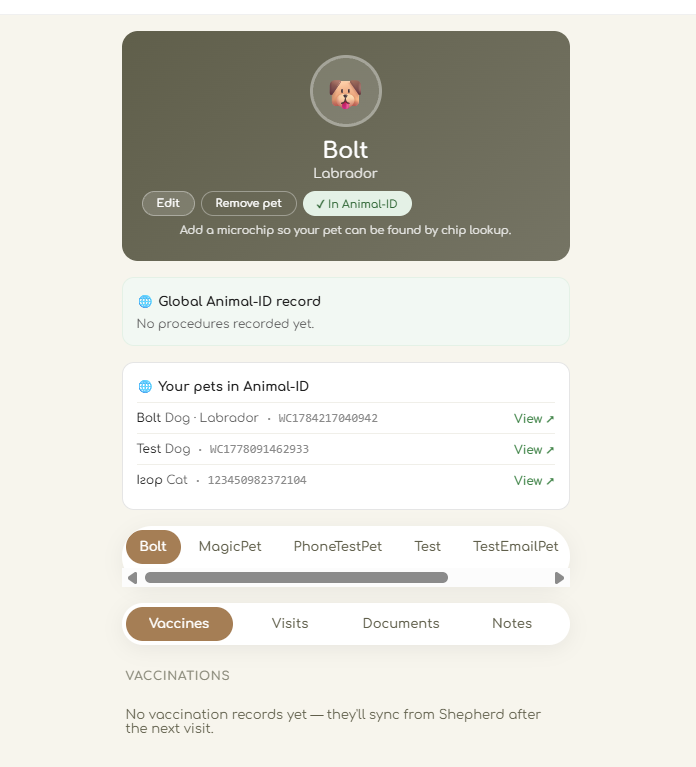
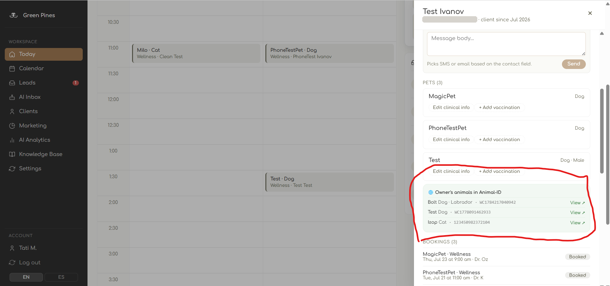

# Case study: Green Pines Veterinary Clinic

The integration this cookbook came out of. A working veterinary practice with a public marketing site, an online booking funnel, a client portal and a staff CRM — all one Django application, none of it built with Animal-ID in mind.

The question was: how much of the registry can you bring **into** software that already exists, without sending anyone to `animal-id.net`?

Answer: all of it. Below is every screen, the API call behind it, and the recipe that builds it.

> **Want the code, not the tour?**
> [`examples/python/animalid_client.py`](../../examples/python/animalid_client.py) is a complete signed client — standard library only, ~180 lines. Set four environment variables and run it directly; it verifies your credentials and prints the result. Every snippet below imports from it.

*Screenshots are from the staging environment. All pets and clients shown are test data.*

---

## 1. Public site — "Found a lost pet?"

A microchip lookup on the clinic's **own** home page. Anyone who finds a stray types the chip number and gets the pet's registry card, plus a link to its public profile — and the clinic's phone number right underneath.

No login, no account, no redirect to a third-party site. The visitor never learns there's an API involved.

| | |
|---|---|
| **API call** | `GET /animals/by-identifier/{value}` |
| **Auth needed** | Your clinic's credentials only — the visitor needs nothing |
| **Consent needed** | None. This is public registry data. |
| **Build it** | [`recipes/lookup.md`](../../recipes/lookup.md) |

This is the one to ship first. It's read-only, impossible to break anything with, and it's immediately obvious to everyone why it's useful.

---

## 2. Booking funnel — chip lookup that fills in the form

Same call, different moment. A client adding a pet during booking types the chip number, hits **Find my pet**, and the species, name, breed and date of birth fill themselves in — *"Found it — details filled in below."*

Fewer fields to type is a small thing. Fewer fields typed **wrong** is not: the pet gets booked under the identity the registry already knows, so the record links cleanly instead of becoming a near-duplicate someone has to merge later.

| | |
|---|---|
| **API call** | `GET /animals/by-identifier/{value}` |
| **Build it** | [`recipes/lookup.md`](../../recipes/lookup.md) |

---

## 3. Booking funnel — one pet list, local *and* registry

The client picks which pet the appointment is for. The list contains **the pets this clinic already knows about and the pets linked to their contact in the registry** — merged, deduped, and badged so it's clear where each one came from.

Deduping is the part that matters. Without it the same dog appears twice, the client picks whichever, and half your bookings point at an unlinked record. The match runs in three steps, most reliable first: stored `animalid_id`, then microchip, then name.

When a registry pet is chosen, the booking creates the local record with the `animalid_id` and microchip **already attached** — so the link is live from the very first appointment.

| | |
|---|---|
| **API call** | `GET /animals/by-owner?email_or_phone=...` |
| **Watch out** | Carry `animalid_id` *and* `microchip` onto anything you create, or the link is silently lost |
| **Build it** | [`recipes/by-owner.md`](../../recipes/by-owner.md) — includes the dedupe code |

---

## 4. Client portal — the pet's global record

Three separate things on one page:

- **`✓ In Animal-ID`** on the pet header — this pet has a global identity. Pets without one get an **Add to Animal-ID** action instead.
- **Global Animal-ID record** — every procedure logged by every partner clinic, not just this one. Read-only, and visually distinct from the clinic's own notes so nobody confuses the two.
- **Your pets in Animal-ID** — every animal linked to this owner's contact, including ones registered by a previous vet.

That last panel got the strongest reaction in practice: clients found records for pets they'd forgotten were registered at all.

Note the honest empty states. *"No procedures recorded yet"* and *"Add a microchip so your pet can be found by chip lookup"* are doing real work — a blank panel reads as broken, a labelled one reads as a next step.

| | |
|---|---|
| **API calls** | `POST /owners` → `POST /animals` → `GET /animals/{id}/procedures` → `GET /animals/by-owner` |
| **Build it** | [`recipes/register.md`](../../recipes/register.md) · [`recipes/history.md`](../../recipes/history.md) · [`recipes/by-owner.md`](../../recipes/by-owner.md) |

---

## 5. Staff CRM — the registry beside the chart

The client drawer, mid-shift. Under the pets this clinic treats sits **Owner's animals in Animal-ID** — the same by-owner call, but aimed at the front desk.

The value is in what it prevents. A client says "she's had all her shots"; the panel shows the pet, its chip, and a link to its record at whichever clinic did them. If the record is locked, staff get a **request access** button instead of a dead end.

Vaccinations recorded here push to the registry on save, as typed procedures — rabies filed as rabies (type `20`), not as generic vaccination.

| | |
|---|---|
| **API calls** | `GET /animals/by-owner` · `POST /animals/{id}/procedures` · `POST /animals/{id}/access-request` |
| **Build it** | [`recipes/procedures.md`](../../recipes/procedures.md) · [`recipes/access.md`](../../recipes/access.md) |

---

## Also wired up, not pictured

| | |
|---|---|
| Pet photos sync to the registry as profile avatars | [`recipes/photos.md`](../../recipes/photos.md) |
| Access requests + a webhook receiver for the owner's answer | [`recipes/access.md`](../../recipes/access.md) |
| Pet edits (breed, colour, sterilization) `PATCH` upstream so the registry doesn't drift | [`docs/endpoints.md`](../../docs/endpoints.md#patch-animalsid) |

---

## What it cost

A few days of working sessions. The code that talks to Animal-ID is roughly:

| Piece | Size |
|---|---|
| Signed API client | ~350 lines, standard library only |
| Mapping / sync service | ~280 lines |
| API endpoints exposed to the frontends | ~12 handlers |
| Database changes | **2 columns + 1 table** |

That last row is worth dwelling on. Linking an existing clinic system to the registry needed **two columns** — an owner `user_gid` on the client, an `animalid_id` on the pet — plus one table to track pending access requests. It is not an architecture change.

---

## What was hard (and what wasn't)

**Not hard:** the API. Auth is one function. Endpoints are predictable. Errors name the fields they don't like. There is no SDK for Python and none was needed.

**Hard:** the undocumented details. The HMAC key being a string rather than hex bytes cost the most. `payload` always being a list cost the second most, and cost it *after* a successful write — which is the worst possible time to find out. Those and twelve others are now in [`docs/gotchas.md`](../../docs/gotchas.md), so they cost you nothing.

**Also hard, but not the API's fault:** deciding where things belong. The first version put a chip lookup inside the CRM appointment drawer. Staff didn't want it there — they don't add animals by hand. It moved. A registry dictionary browser got built and then deleted, because a species list with no breeds isn't useful to anyone. Product decisions, not integration problems.

---

## Who did the work

Most of it: an AI coding agent — writing the signed client, mapping the data model, building the UI, deploying, and verifying against the live API.

The human supplied API credentials, the product decisions above, and approval before anything touched production.

That's the argument this repo exists to make. If an agent can do this end to end, the barrier for your clinic isn't technical difficulty — see [`docs/ai-agent-guide.md`](../../docs/ai-agent-guide.md).

---

## Where to start on your own

1. Copy [`examples/python/animalid_client.py`](../../examples/python/animalid_client.py), set your four environment variables, run it. It tells you in one line whether your credentials sign correctly.
2. Read [`docs/gotchas.md`](../../docs/gotchas.md) **before** you write anything. It's fifteen minutes and it's the difference between an afternoon and a week.
3. Build screen 1 above — [`recipes/lookup.md`](../../recipes/lookup.md). It's read-only, it can't damage anything, and it's the one that makes people in the room understand why this matters.
